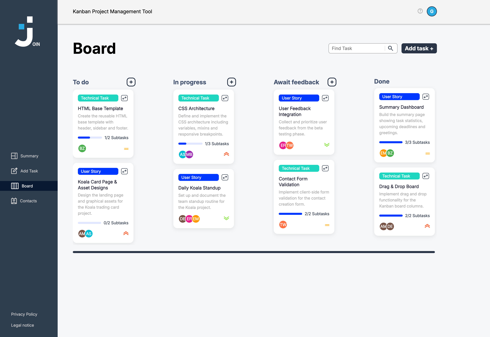

# Join 📋

A Kanban-based task management tool built with vanilla JavaScript and Firebase.

🔗 [Live Demo](https://join.christopher-braun-dev.de)

## ✨ Features
- Kanban board with drag & drop (To Do, In Progress, Await Feedback, Done)
- Create, edit and delete tasks with subtasks and priorities
- Contact management
- User authentication via Firebase
- Responsive design for desktop and mobile

## 🛠️ Technologies
- Vanilla JavaScript (ES Modules)
- Firebase Realtime Database & Authentication
- HTML5 / CSS3

## 📁 Project structure
- `js/` — Application logic (auth, board, tasks, contacts)
- `css/` — Stylesheets per page
- `assets/` — Icons, images, fonts

## 🚀 Installation
1. Clone the repository
2. Copy `js/firebaseAuth.example.js` to `js/firebaseAuth.js` and add your Firebase credentials
3. Open `index.html` in your browser (or use a local server)

## 👥 Team
Developed as a group project at Developer Akademie by Christopher Braun, Filip Rozanowski and Mischa Siegrist.

## ⚠️ Notice
Image assets are property of Developer Akademie GmbH and may not be used without permission.
